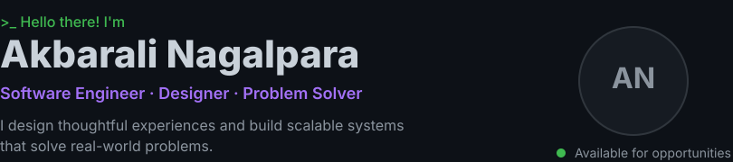
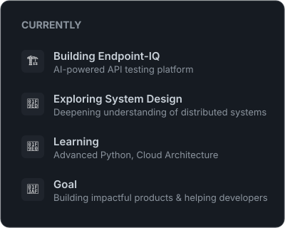
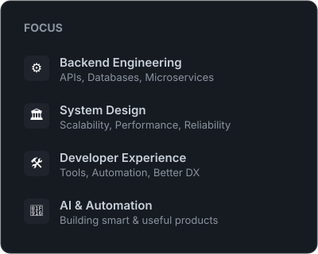
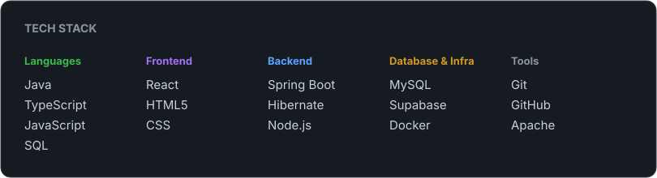
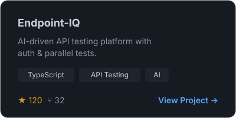
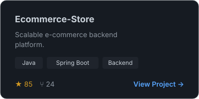

 
&nbsp;

   

&nbsp;

  

  

<h3 align="left" id="featured-projects" style="width: 810px; margin: 0 auto; color: #8b949e; font-size: 14px; letter-spacing: 1px;">FEATURED PROJECTS</h3>

&nbsp;

  

<h3 align="left" style="width: 810px; margin: 0 auto; color: #8b949e; font-size: 14px; letter-spacing: 1px;">GITHUB ENGINEERING STATS</h3>

&nbsp;

  

<h3 align="left" style="width: 810px; margin: 0 auto; color: #8b949e; font-size: 14px; letter-spacing: 1px;">CONTRIBUTION ACTIVITY</h3>

   

<h3 align="center" style="color: #8b949e; font-size: 14px; letter-spacing: 1px;">LET'S CONNECT</h3>

  

  Thanks for visiting.

