<div align="center">


# AKBARALI NAGALPARA

### `BACKEND ENGINEER` | `FULL-STACK DEVELOPER`

Building reliable systems, scalable APIs and useful software.<br>
<span style="color: #00d2ff;">● ONLINE</span>

<br/>

[](https://github.com/Akbarali-Nagalpara)
[](YOUR_LINKEDIN_URL)
[](YOUR_PORTFOLIO_URL)

<br/>

</div>

---

<div align="center">

## 🎛️ ENGINEERING STATUS

<table>
<tr>
<td>

```text
STATUS       ● BUILDING
ROLE         BACKEND ENGINEER
FOCUS        SYSTEM DESIGN
MODE         FULL-STACK
```

</td>
</tr>
</table>

</div>

---

<div align="center">

## ⚙️ ENGINEERING FOCUS

<table>
<tr>
<td width="300">

**⚙ BACKEND**<br><br>
`APIs`<br>
`Services`<br>
`Business Logic`

</td>
<td width="300">

**🏗 SYSTEM DESIGN**<br><br>
`Architecture`<br>
`Scalability`<br>
`Distributed Sys`

</td>
</tr>
<tr>
<td>

**🗄 DATABASE**<br><br>
`Data Modeling`<br>
`MySQL`<br>
`Supabase`

</td>
<td>

**💻 FULL STACK**<br><br>
`React`<br>
`JavaScript`<br>
`UI/UX`

</td>
</tr>
</table>

</div>

---

<div align="center">

## 🏗️ How I Think About Systems

```text
                    CLIENT
                       │
                       ▼
               ┌──────────────┐
               │   REST API   │
               └──────┬───────┘
                      │
                      ▼
             ┌─────────────────┐
             │ BUSINESS LOGIC  │
             └────────┬────────┘
                      │
              ┌───────┴────────┐
              ▼                ▼
        ┌──────────┐      ┌──────────┐
        │ DATABASE │      │ SERVICES │
        └──────────┘      └──────────┘
```

*I enjoy understanding how components communicate, where bottlenecks appear, and how systems can evolve as they scale.*

</div>

---

<div align="center">

## 🛠️ TECH STACK

<table>
<tr>
<td width="150"><strong>BACKEND</strong></td>
<td>Java · Spring Boot · Hibernate</td>
</tr>
<tr>
<td><strong>FRONTEND</strong></td>
<td>React · JavaScript · HTML5</td>
</tr>
<tr>
<td><strong>DATABASE</strong></td>
<td>MySQL · Supabase</td>
</tr>
<tr>
<td><strong>LANGUAGES</strong></td>
<td>Java · JavaScript · C</td>
</tr>
</table>

</div>

---

<div align="center">

## 🚀 FEATURED ENGINEERING

<table>
<tr>
<td width="600">

### 01 / Project One Placeholder
<br>

**Backend Platform**

Description of the engineering problem and how the project solves it. Focus on architecture, interesting engineering decisions, and the overall result.
<br><br>
`Java` `Spring Boot` `MySQL`
<br><br>
[Architecture / Repository →](#)

</td>
</tr>
<tr>
<td width="600">

### 02 / Project Two Placeholder
<br>

**Full-Stack Application**

Description of the engineering problem and how the project solves it. Focus on architecture, interesting engineering decisions, and the overall result.
<br><br>
`React` `JavaScript` `Supabase`
<br><br>
[Architecture / Repository →](#)

</td>
</tr>
</table>

</div>

---

<div align="center">

## 🧠 CURRENTLY EXPLORING

```text
System Design
       ↓
Backend Architecture
       ↓
Distributed Systems
       ↓
Database Optimization
       ↓
Scalable Applications
```

</div>

---

<div align="center">

## 📊 SYSTEM TELEMETRY

<br>



<br><br>



</div>

---

<div align="center">

## 💡 ENGINEERING PHILOSOPHY

<br>

`BUILD` ➔ `UNDERSTAND` ➔ `IMPROVE` ➔ `REPEAT`

I learn by building real systems from the ground up and iteratively improving them to solve complex engineering challenges.

</div>

---

<div align="center">

## 🤝 CONNECT

<table>
<tr>
<td>
<a href="https://github.com/Akbarali-Nagalpara">[ GitHub ]</a>
</td>
<td>
<a href="YOUR_LINKEDIN_URL">[ LinkedIn ]</a>
</td>
<td>
<a href="YOUR_PORTFOLIO_URL">[ Portfolio ]</a>
</td>
</tr>
</table>

<br/>

──────────────────────────────────────────────

**BUILD • LEARN • IMPROVE**

──────────────────────────────────────────────

</div>
